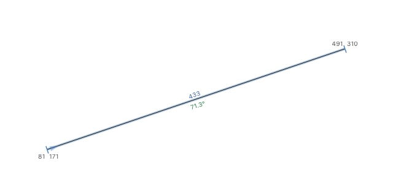
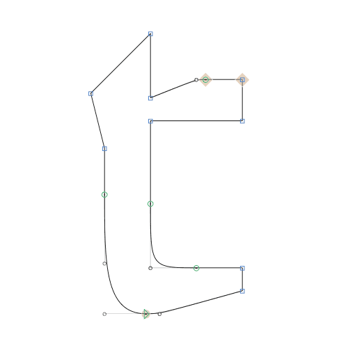

# Show Coordinates Distance Angle

A plugin for the [Glyphs font editor](http://glyphsapp.com/).

Display coordinates above or below the selected nodes and handles, and display distances and angles along the path lines.

Shortcut assigned: `⌘L`

- Coordinates are displayed in black, distances are in blue, and angles are in green.
- Distances and angles are displayed along the path lines – distances are above and angles are below the line.
- Angles that are multiples of 90 degrees (along the `x` and `y` axes) are not displayed.
- The angles are respected to the italics angle.
- Coordinates, distances and angles at the very small display zoom size are not displayed.
- Dark mode supported.

## Changelog

See [CHANGELOG.md](CHANGELOG.md) for version history.

## Donate

This plugin is free to use. If it saves you time or makes your work easier, consider supporting my work:

[Ko-fi](https://ko-fi.com/michaelrafailyk), [PayPal](https://www.paypal.com/donate/?hosted_button_id=NF99TTG7WLHZS)
