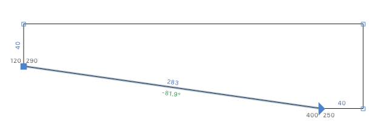

# ShowCoordinatesDistanceAngle.glyphsReporter

A plugin for the [Glyphs font editor](http://glyphsapp.com/) displaying coordinates, distances, and angles for selected nodes (and handles) along the path line.

- Coordinates are displayed in black, distances are in blue, and angles are in green.
- Coordinates, distances and angles are displayed when 12 or less nodes selected. It could be changed on `line 52` of the `plugin.py`.
- Coordinates are displayed for only one or two selected nodes. It could be changed on `line 66` of the `plugin.py`.
- Distances and angles are displayed along the path lines – distances are above and angles are below the line.
- Angles that are multiples of 90 degrees (along the `x` and `y` axes) are not displayed.
- The angles are respected to the italics angle.
- Coordinates, distances and angles at the very small display zoom size are not displayed.
- Dark mode supported.

Shortcut: `⌘L`

# License

Copyright 2023 Michael Rafailyk (@michaelrafailyk).

Licensed under the Apache License, Version 2.0 (the "License"); you may not use the software provided here except in compliance with the License. You may obtain a copy of the License at

http://www.apache.org/licenses/LICENSE-2.0

See the License file included in this repository for further details.
